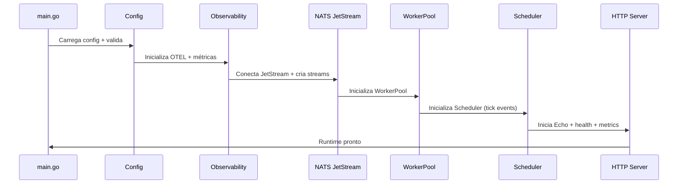

# 🚀 BLOCO-1 BLUEPRINT EXECUTIVO — VERTIKON v11 (CORRIGIDO)

## STATUS  
Executivo • Versão 1.1 • Atualizado para Baseline Vertikon v11  
PRIORIDADE: Crítica • Fundação do Sistema mcp-fulfillment-ops/Core Runtime

---

## 📋 SUMÁRIO EXECUTIVO
O **BLOCO‑1** é o coração operacional do ecossistema Vertikon v11 no módulo MCP‑Hulk.  
Ele fornece o **runtime**, os **executores**, o **motor de tarefas**, o **ciclo de vida dos agentes**, e todos os subsistemas de **observabilidade, resiliência e mensageria**, que serão usados pelos blocos superiores (AI Engine, State Engine, Orquestradores, Funis etc.).

Sem o BLOCO‑1, **nenhum outro módulo pode rodar**.

---

## 🎯 OBJETIVOS ESTRATÉGICOS

### Objetivo Principal
Construir um runtime altamente performático, escalável, resiliente, rastreável e preparado para multi‑tenant, seguindo 100% o baseline **Vertikon v11**:

- NATS JetStream como backbone de eventos  
- Observabilidade OTEL (tracing) + Prometheus (métricas) + Logs estruturados (zap)  
- WorkerPool determinístico e seguro  
- Cache multi‑nível  
- Circuit breaker + timeouts + retry/backoff  
- Shutdown gracioso  
- Alta disponibilidade

---

## 📐 ARQUITETURA DO BLOCO‑1 (CORRIGIDA)

### Diretórios oficiais

```
├── cmd/
│   ├── main.go                  # HTTP/API + bootstrap completo
│   ├── thor/main.go             # CLI administrativa
│   └── mcp-server/main.go       # Runtime MCP
│
├── internal/
│   ├── config/                  # Sistema robusto (YAML + env + validação)
│   ├── core/
│   │   ├── engine/              # Execution engine + workers
│   │   ├── scheduler/           # Task scheduler com NATS
│   │   ├── cache/               # Multi-level (L1/L2/L3)
│   │   ├── breaker/             # Circuit breakers
│   │   ├── state/               # Persistência interna (BadgerDB)
│   │   └── events/              # NATS JetStream bindings
│   └── observability/           # OTEL + Prometheus
│
├── pkg/
│   ├── logger/                  # Zap wrapper
│   ├── httpserver/              # Echo server com middlewares Vertikon
│   ├── utils/                   # Helpers
│   └── validator/               # Validações
│
└── tests/
    └── ...                      # Table-driven tests (85%+)
```

---

## 🔧 SUBSISTEMAS OBRIGATÓRIOS (VERTIKON v11)

### 1) Logging (zap)
- JSON structured  
- trace_id + span_id incluídos  
- níveis dinâmicos por env

### 2) Observabilidade
- **Tracing OTEL** → Jaeger (export direto)  
- **Métricas Prometheus** → `/metrics` (Echo middleware)  
- **Logs** com correlação automática  

### 3) NATS JetStream (obrigatório)
Streams:
- `hulk.engine.tasks`  
- `hulk.engine.events`  
- `hulk.scheduler.queue`  
- `hulk.errors`  

Subjects:
- `hulk.task.created`  
- `hulk.task.completed`  
- `hulk.task.failed`  
- `hulk.scheduler.tick`  
- `hulk.runtime.health`  

### 4) WorkerPool
```
workers = runtime.NumCPU() * 2
```
Características:
- fila interna com backpressure  
- timeouts por tarefa  
- retry com backoff exponencial  
- cancelamento via context  

### 5) Cache Multi-level (correto)
- **L1**: memória local (sync.Map)  
- **L2**: Redis  
- **L3**: BadgerDB snapshots  

### 6) Circuit Breaker
Correto:
- janela móvel  
- threshold por taxa de falha  
- recovery automático com jitter  

---

## 🗂️ CONFIGURAÇÃO OFICIAL

`config.yaml` mínimo:

```yaml
server:
  port: 8080
  read_timeout: 30s
  write_timeout: 30s

engine:
  workers: "auto"     # auto = NumCPU*2
  queue_size: 2000
  timeout: 20s

cache:
  l1_size: 5000
  l2_ttl: 1h
  l3_path: "data/cache"

nats:
  urls: ["nats://localhost:4222"]
  user: ""
  pass: ""

logging:
  level: "info"
  format: "json"

telemetry:
  tracing:
    enabled: true
    exporter: "jaeger"
    endpoint: "http://localhost:4318/v1/traces"
  metrics:
    enabled: true
```

---

## 📈 PERFORMANCE REALISTA (CORRIGIDO)

| Componente | Métrica | Alvo | Observação |
|-----------|---------|------|------------|
| WorkerPool | Throughput | 200–600 msgs/s | Dependente do hardware |
| HTTP Server | P95 | < 60ms | Echo + OTEL |
| Cache L1 | Hit Ratio | 70–90% | Workload-dependente |
| Circuit Breaker | Recovery | < 2s | Com jitter |
| Bootstrap | Cold Start | < 4s | Com NATS + OTEL |

---

## 🔄 FLUXO DE INICIALIZAÇÃO (CORRIGIDO)



---

## 🧪 TESTES OBRIGATÓRIOS

### Unitários
- 85%+  
- Mocks via gomock  
- Table-driven tests

### Integração
- Echo HTTP  
- NATS JetStream  
- Scheduler  
- Circuit Breaker  

### Carga
- `hey`  
- `k6`  
- `wrk`  

---

## 🚨 RISCOS & MITIGAÇÕES (CORRIGIDO)

| Risco | Descrição | Mitigação |
|-------|-----------|-----------|
| NATS indisponível | Engine não processa tasks | Retry + fallback logging |
| WorkerPool saturado | Backpressure extremo | Auto‑scaling + limites |
| Circuit breakers travados | Fluxo interrompido | Health loop interno |
| Cache L2 offline | Latência sobe | L1 + L3 como fallback |

---

## ✔ CHECKLIST FINAL PARA APROVAÇÃO

- [ ] Logs com zap + trace_id  
- [ ] NATS JetStream com streams criados  
- [ ] WorkerPool auto dimensionado  
- [ ] Cache L1/L2/L3 funcional  
- [ ] Scheduler emitindo ticks  
- [ ] OTEL tracing + Prometheus ativos  
- [ ] `/health`, `/ready`, `/metrics` funcionando  
- [ ] Shutdown gracioso testado  
- [ ] Test coverage 85%+  
- [ ] Load test aprovado  

---

## 🏆 ESTADO FINAL
Após implementação do BLOCO‑1:

- Runtime estável  
- Resiliência completa  
- Observabilidade full-stack  
- Integração nativa ao ecossistema Vertikon v11  
- Pronto para BLOCO‑2 (AI) e BLOCO‑3 (State)  

**DOCUMENTO FINALIZADO — BLOCO‑1 BLUEPRINT EXECUTIVO (v11)**

