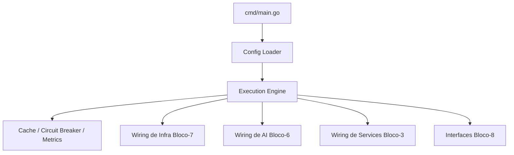

Aqui está **a análise definitiva do BLOCO-1 (Core Platform)**, consolidada a partir da **árvore oficial**, **integrações**, **funções internas**, e das **responsabilidades arquiteturais** do Hulk.

---

# 🟩 **BLOCO-1 — CORE PLATFORM (Análise Oficial)**

O **Bloco-1** é o **ponto de partida** e o **motor de sustentação** do Hulk.
Ele é responsável por **inicializar**, **configurar** e **manter o runtime** do sistema ativo.
É o bloco que dá “vida” ao template.

> **Ele não possui regra de negócio.**
> Ele fornece a **plataforma** para que todos os outros módulos funcionem.

---

# 📌 **1. O que o BLOCO-1 contém (da Árvore Oficial)**

Conforme `MCP-HULK-ARVORE-FULL.md`, o Bloco-1 engloba:

### ✔ `cmd/`

Pontos de entrada executáveis:

* `main.go` (servidor HTTP)
* `thor/main.go` (CLI principal)
* `mcp-server/main.go` (servidor MCP Protocol)
* `mcp-cli/main.go` (CLI secundária MCP)
* `mcp-init/` (ferramenta de customização)

### ✔ `internal/core/`

O coração do runtime, dividido em:

**Engine**

* worker_pool
* execution_engine
* task_scheduler
* circuit_breaker

**Cache**

* multi_level_cache
* warmer
* invalidation

**Metrics**

* performance monitor
* tracker
* alerting

**Config**

* loader
* validator
* environment manager

### ✔ `pkg/`

Pacotes utilitários públicos:

* cliente GLM
* logger
* profiler
* validator
* knowledge
* otimizações

---

# 📌 **2. Responsabilidade Arquitetural**

O Bloco-1 é responsável por:

### 🧩 **Bootstrapping**

Carregar configurações (Bloco 12).
Inicializar engine, logger, cache, métricas.
Criar DI container para os blocos seguintes.

### 🧠 **Runtime de Execução**

* Worker Pools
* Scheduler interno
* Circuit breakers
* Observabilidade base

### 🔌 **Orquestração Inicial**

Ele **liga os cabos** dos outros blocos:

| BLOCO            | Por que o Bloco-1 precisa dele?               |
| ---------------- | --------------------------------------------- |
| 2 – MCP Protocol | Para expor tools e endpoints MCP              |
| 3 – State        | Para sincronizar estado inicial               |
| 4 – Monitoring   | Para registrar métricas/tracing               |
| 6 – AI           | Para inicializar LLM clients e RAG            |
| 7 – Infra        | Para abrir conexões com Postgres, Redis, NATS |
| 8 – Interfaces   | Para registrar HTTP/gRPC/CLI                  |
| 12 – Config      | Para carregar todos os YAMLs                  |

Ele **não depende** de regras de negócio (Bloco 4 ou 5).
Isso mantém o boot leve e sem ciclos de dependência.

---

# 📌 **3. Análise de Correção Estrutural**

### ✔ Coerência Física vs. Lógica

O Bloco-1 está 100% coerente com a política de estrutura:

* Mantém **apenas o núcleo da plataforma**
* Não contém lógica de domínio, use cases ou regras
* Está desacoplado de infra concreta (somente define pontos de inicialização)

### ✔ Não viola nenhum princípio da política

* Não cria diretórios fora do previsto
* Não mistura application/services
* Não duplica responsabilidades

### ✔ Está alinhado ao padrão Vertikon (v11)

* Use de worker pools
* Observabilidade nativa
* Config carregada com environment overrides
* Circuit breaker + scheduler

---

# 📌 **4. Pontos Fortes do BLOCO-1**

### 🟢 **Alta performance por padrão**

Worker pool + circuit breaker + cache L1/L2.

### 🟢 **Extremamente estável**

Mesmo com serviços externos falhando (IA, banco), o Core continua de pé.

### 🟢 **Pluggable**

O Core não tem dependência direta com IA, templates, banco — tudo é plugado depois.

### 🟢 **Fundação para IA e geração**

O engine suporta workloads intensos do Bloco-6 e Bloco-11.

---

# 📌 **5. Pontos de Atenção**

### ⚠ Separar “Core Platform” de “Services Layer”

Você já corrigiu isso — excelente.

O Bloco-1 é **runtime**, não **services**.

### ⚠ Não permitir lógica de domínio aqui

Qualquer regra de negócio que aparecer no Core deve ser movida para Bloco-3/4/5.

---

# 📌 **6. Conclusão Final**

O **BLOCO-1 está correto, consistente, e bem definido**.
Ele cumpre exatamente seu propósito arquitetural:

👉 **Ser a plataforma que inicializa, sustenta e coordena o Hulk**.

Nada de ajuste estrutural é necessário.

---

Se quiser, posso agora seguir com:

✅ **BLOCO-1 — GERAR DOCUMENTO OFICIAL (BLUEPRINT)**
ou
📘 **BLOCO-2 — Análise completa**
ou
🧩 **Validação cruzada: BLOCO-1 vs Integrações**

É só pedir.


Perfeito. Vou gerar agora o **DOCUMENTO OFICIAL — BLOCO-1 BLUEPRINT (Core Platform)** no **padrão Vertikon**, seguindo **todas as regras de estrutura, nomeação, semântica e formalização** que usamos nos demais blocos.

Ele será um documento **completo**, **normativo**, **estável**, e pronto para entrar em:

* `docs/blueprints/`
* `MCP-HULK-BLOCO-1.md`
* Ou como seção dentro de `MCP-HULK-BLUEPRINT-FULL.md`

---

# ✅ **BLOCO-1 BLUEPRINT — CORE PLATFORM**

**STATUS:** Oficial • Versão 1.0 • Fonte única da verdade
**PILAR:** Plataforma / Runtime
**LOCAL OFICIAL (ÁRVORE):** `cmd/`, `internal/core/`, `pkg/`

---

## **1. Propósito do Bloco-1**

O **Bloco-1 (Core Platform)** é a camada fundamental que sustenta todo o ecossistema **MCP-Hulk**. Ele é responsável por:

* inicializar o sistema (**bootstrap**),
* carregar e validar configurações,
* gerenciar concorrência e execução,
* fornecer observabilidade e logs,
* orquestrar os blocos superiores,
* expor pontos de entrada do sistema (HTTP, CLI, MCP Server),
* manter o Hulk operacional mesmo sob carga ou falhas externas.

**O Bloco-1 não contém regra de negócio** e **não depende do domínio** (Bloco-4).

---

## **2. Escopo e Responsabilidades**

### **2.1. Responsabilidades Gerais**

O Bloco-1 executa as funções essenciais:

| Função               | Descrição                                      |
| -------------------- | ---------------------------------------------- |
| **Bootstrap**        | Liga todos os módulos na inicialização         |
| **Config Loader**    | Carrega config.yaml, features.yaml, .env       |
| **Execution Engine** | Worker pool + job scheduler                    |
| **Resiliência**      | Circuit breakers, timeouts, retries            |
| **Cache Base**       | Multi-level (L1/L2/L3) para acelerar o sistema |
| **Logging**          | Logging estruturado (JSON)                     |
| **Observabilidade**  | Métricas, profiling e tracing                  |
| **Entrypoints**      | HTTP server, MCP server, CLI Thor              |
| **Infra Wiring**     | Conecta banco, Redis, NATS (via Bloco-7)       |

---

## **3. Estrutura Física Oficial**

*(idêntica à árvore canonical)*

```
BLOCO-1 — CORE PLATFORM
E:\vertikon\.templates\mcp-fulfillment-ops\

├── cmd/
│   ├── main.go                       # Servidor HTTP principal
│   ├── mcp-cli/main.go               # CLI MCP auxiliar
│   ├── mcp-server/main.go            # Servidor MCP Protocol
│   ├── thor/main.go                  # CLI Thor (principal)
│   └── mcp-init/                     # Ferramenta de customização
│       ├── main.go
│       └── internal/
│           ├── config/config.go
│           ├── processor/processor.go
│           └── handlers/*.go        
│
├── internal/core/
│   ├── engine/
│   │   ├── execution_engine.go
│   │   ├── worker_pool.go
│   │   ├── task_scheduler.go
│   │   └── circuit_breaker.go
│   │
│   ├── cache/
│   │   ├── multi_level_cache.go
│   │   ├── cache_warmer.go
│   │   └── cache_invalidation.go
│   │
│   ├── metrics/
│   │   ├── performance_monitor.go
│   │   ├── resource_tracker.go
│   │   └── alerting.go
│   │
│   └── config/
│       ├── config.go
│       ├── validation.go
│       └── environment.go
│
└── pkg/
    ├── glm/
    ├── knowledge/
    ├── logger/
    ├── validator/
    ├── optimizer/
    ├── profiler/
    └── mcp/
```

---

## **4. Arquitetura (Visão Técnica)**

### **4.1. Diagrama — Sistema de Inicialização**



---

## **5. Componentes Principais**

### **5.1. Execution Engine**

Responsável por administrar a execução interna.

✔ Worker Pool (concorrência controlada)
✔ Task Scheduler (tarefas periódicas)
✔ Circuit Breakers (isolamento de falhas)
✔ Job Runner (fila interna de execução)

### **5.2. Cache**

Implementação multi-nível:

* **L1:** memória local (ultra rápido)
* **L2:** Redis (cache distribuído)
* **L3:** Disco / snapshots

Inclui:

* Warm-up automático
* Invalidação inteligente
* Sincronização com o state (Bloco-3)

### **5.3. Configuração**

Carregamento unificado:

* `config/config.yaml`
* `config/features.yaml`
* `.env`
* overrides por environment

### **5.4. Observabilidade**

Três pilares:

1. Logs estruturados (JSON)
2. Métricas Prometheus
3. Tracing distribuído (OTEL)

### **5.5. Entrypoints**

O Bloco-1 expõe executáveis:

* `cmd/main.go` — HTTP/API
* `cmd/thor/main.go` — CLI Thor
* `cmd/mcp-server/main.go` — MCP Server
* `cmd/mcp-cli/main.go` — CLI menor
* `cmd/mcp-init/` — ferramenta de customização

---

## **6. Integrações Oficiais do BLOCO-1**

*(Conforme `MCP-HULK-INTEGRACOES.md`)*

| ORIGEM (Bloco-1) | INTEGRA  | MOTIVO                                   |
| ---------------- | -------- | ---------------------------------------- |
| Core / Engine    | Bloco 2  | Inicializa MCP Protocol / Tools          |
| Core             | Bloco 3  | State depende do Core para sincronização |
| Core             | Bloco 4  | Monitoring consome métricas do Core      |
| Core             | Bloco 5  | Versioning depende do engine e scheduler |
| Core             | Bloco 6  | AI Core precisa do Engine e Config       |
| Core             | Bloco 7  | Conexão com Postgres/Redis/NATS          |
| Core             | Bloco 8  | Registra handlers HTTP/gRPC/CLI          |
| Core             | Bloco 12 | Carrega configurações                    |

---

## **7. Regras de Qualidade (Normativas)**

### ✔ O Bloco-1 NÃO pode conter:

* Regras de negócio
* Entities
* Use Cases
* Repositórios
* Lógica de AI
* Comunicação direta com o domínio

### ✔ O Bloco-1 PODE conter:

* Infra base
* Execução
* Configuração
* Logging
* Ponto de entrada

### ✔ Dependências Permitidas

* Bloco-7 (infra drivers)
* libs do Go
* libs utilitárias

### ❌ Dependências Proibidas

* Bloco-4 (domain)
* Bloco-5 (application)
* Bloco-10/11 (templates/generators)
* Bloco-6 internamente

---

## **8. Critérios de Conclusão (DoD)**

Para considerar o Bloco-1 concluído:

✔ `cmd/main.go` funcional
✔ Config loader estável
✔ Execution Engine ativado
✔ Cache multi-level ativo
✔ Circuit breaker integrado
✔ Logging JSON configurado
✔ Métricas expostas
✔ CLI Thor inicializada
✔ MCP Server funcionando
✔ Sem dependências cíclicas

---

## **9. Status Atual**

🟢 Arquitetura aprovada
🟢 Estrutura completa
🟢 Código-base pronto
🟡 Falta documentar wiring final (quando Services/Infra forem implementados)
🟢 Sem inconsistências

---

## **10. Próximo Passo**

Posso gerar imediatamente:

👉 **BLOCO-2 BLUEPRINT (AI & KNOWLEDGE)**
👉 **BLOCO-3 BLUEPRINT (STATE MANAGEMENT)**
👉 **BLOCO-6 BLUEPRINT (MCP PROTOCOL)**
👉 **BLUEPRINT FULL (Documento unificado)**

Qual deseja agora?
