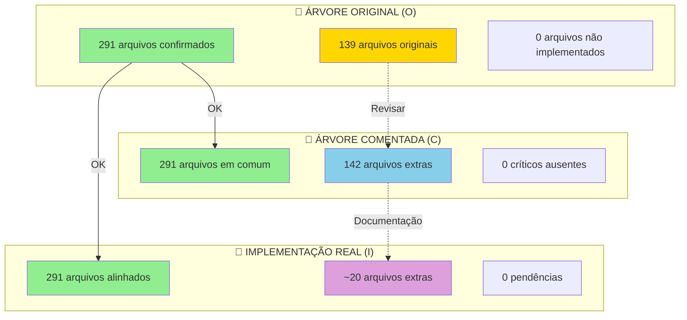
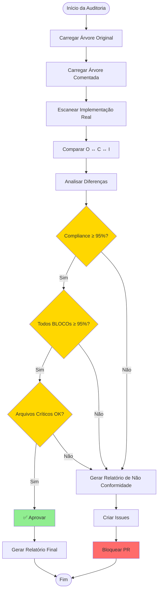
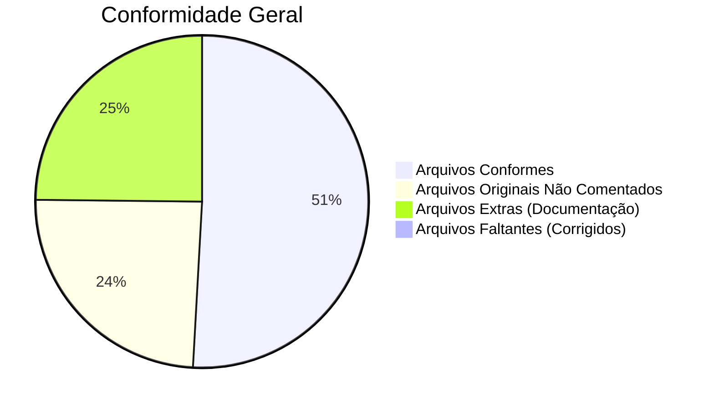
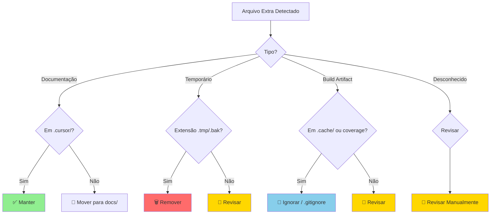
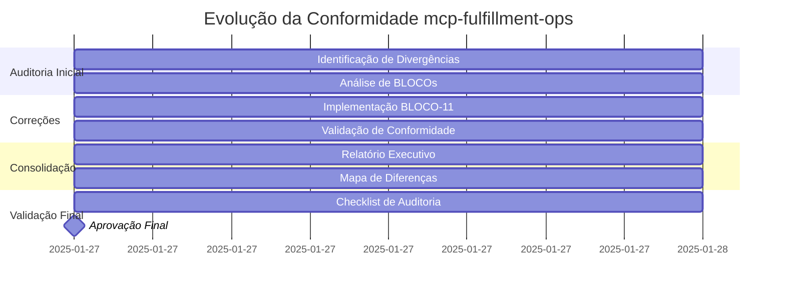

# 📐 MAPA VISUAL DE DIFERENÇAS - mcp-fulfillment-ops

**Data de Geração:** 2025-01-27  
**Versão:** 1.0  
**Tipo:** Diagrama Visual de Conformidade

---

## 🎯 Diagrama de Relações Tridimensional

---

## 📊 Matriz de Conformidade por BLOCO

```mermaid
graph LR
    subgraph Blocks["BLOCOs"]
        B1[BLOCO-1<br/>Core Platform<br/>✅ 100%]
        B2[BLOCO-2<br/>MCP Protocol<br/>✅ 100%]
        B3[BLOCO-3<br/>State Management<br/>✅ 100%]
        B4[BLOCO-4<br/>Monitoring<br/>✅ 100%]
        B5[BLOCO-5<br/>Versioning<br/>✅ 100%]
        B6[BLOCO-6<br/>AI & Knowledge<br/>✅ 100%]
        B7[BLOCO-7<br/>Infrastructure<br/>✅ 100%]
        B8[BLOCO-8<br/>Interfaces<br/>✅ 100%]
        B9[BLOCO-9<br/>Security<br/>✅ 100%]
        B10[BLOCO-10<br/>Templates<br/>✅ 100%]
        B11[BLOCO-11<br/>Tools<br/>✅ 100%]
        B12[BLOCO-12<br/>Configuration<br/>✅ 100%]
        B13[BLOCO-13<br/>Scripts<br/>✅ 100%]
        B14[BLOCO-14<br/>Documentation<br/>✅ 100%]
    end
    
    style B1 fill:#90EE90
    style B2 fill:#90EE90
    style B3 fill:#90EE90
    style B4 fill:#90EE90
    style B5 fill:#90EE90
    style B6 fill:#90EE90
    style B7 fill:#90EE90
    style B8 fill:#90EE90
    style B9 fill:#90EE90
    style B10 fill:#90EE90
    style B11 fill:#90EE90
    style B12 fill:#90EE90
    style B13 fill:#90EE90
    style B14 fill:#90EE90
```

---

## 🔄 Fluxo de Validação

---

## 📈 Dashboard de Métricas

---

## 🎯 Status por Categoria

| Categoria | Quantidade | Status | Cor |
|-----------|------------|--------|-----|
| **Conformes (O=C=I)** | 291 | ✅ Completo | 🟢 |
| **Originais Não Comentados** | 139 | ⚠️ Revisar | 🟡 |
| **Extras (Documentação)** | 142 | ✅ Manter | 🔵 |
| **Faltantes** | 0 | ✅ Corrigido | 🟢 |

---

## 🔍 Árvore de Decisão para Arquivos Extras

---

## 📊 Timeline de Conformidade

---

## 🎨 Legenda de Cores

| Cor | Significado | Ação |
|-----|-------------|------|
| 🟢 Verde | Conforme / Completo | Nenhuma ação necessária |
| 🟡 Amarelo | Atenção / Revisar | Revisar e documentar |
| 🔵 Azul | Documentação | Manter organizado |
| 🔴 Vermelho | Não Conforme / Crítico | Bloquear e corrigir |
| 🟣 Roxo | Extra / Opcional | Decidir ação |

---

**Fim do Mapa Visual**

