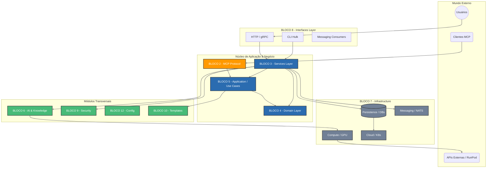
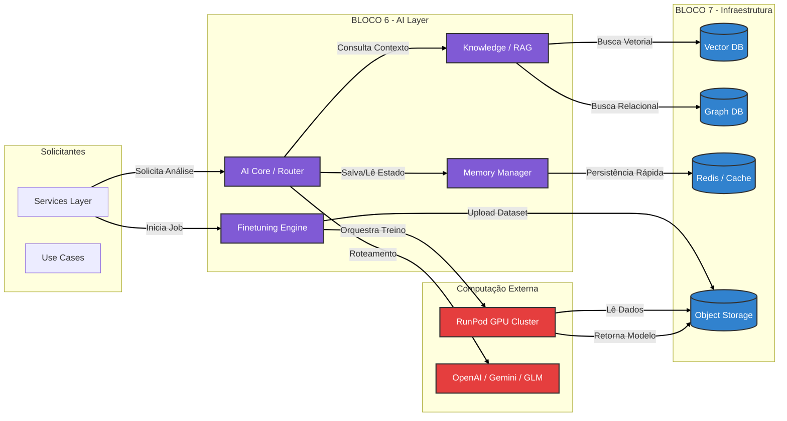
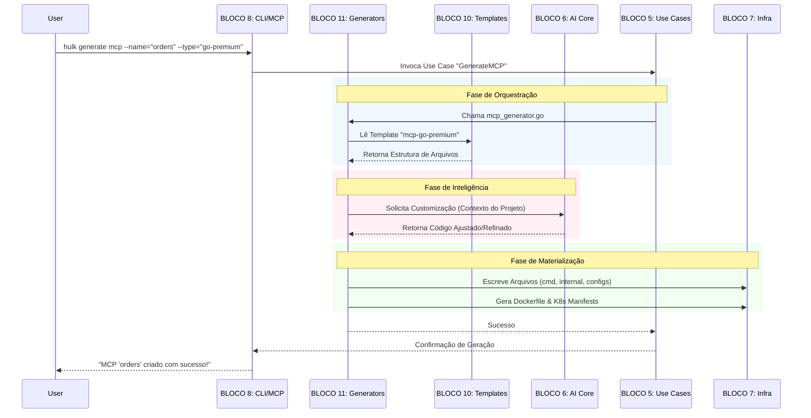

Com certeza. Transformar as tabelas de integração em diagramas visuais é a melhor maneira de validar o fluxo de dados e dependências.

Baseado nos arquivos `mcp-fulfillment-ops-INTEGRACOES.md` e `mcp-fulfillment-ops-ARVORE-FULL.md`, preparei três visualizações estratégicas:

1.  **Arquitetura de Alto Nível (Macro):** Mostra como as camadas se empilham (Clean Architecture).
2.  **Fluxo do "Cérebro" (AI & Dados):** Foca no Bloco 6 e suas conexões vitais.
3.  **Fluxo de Execução MCP:** Como uma requisição trafega do Protocolo até a Infraestrutura.

-----

### 1\. Visão Macro: O Ecossistema Hulk (Clean Architecture)

Este diagrama organiza os 14 blocos em camadas lógicas, demonstrando que o **Domínio (Bloco 4)** é o núcleo protegido, enquanto a **Infraestrutura (Bloco 7)** e **Interfaces (Bloco 8)** ficam nas bordas.

**Análise do Diagrama:**

  * Note como o **Bloco 3 (Services)** atua como o grande orquestrador, conectando Interfaces, AI e Infraestrutura.
  * O **Bloco 2 (MCP Protocol)** tem um caminho privilegiado direto para a Application Layer, permitindo que agentes e ferramentas operem o sistema.

-----

### 2\. O "Cérebro": Fluxo de IA e Conhecimento (Bloco 6)

Este diagrama detalha as integrações complexas do **Bloco 6**, mostrando a separação entre o processamento local e o processamento pesado (GPU Externa/RunPod), conforme definido na arquitetura.

**Destaque:**

  * Visualiza claramente a regra de negócio onde o **Finetuning** (Bloco 6) usa a **Infra de Compute** para delegar jobs ao **RunPod**.
  * Mostra a dependência crítica do RAG com os bancos Vetoriais e de Grafo (Infraestrutura).

-----

### 3\. Fluxo de Geração de Código (MCP & Templates)

Este diagrama de sequência ilustra o "superpoder" do Hulk: um comando via CLI ou Chatbot que gera um novo microsserviço completo.

**O que este fluxo valida:**

  * A integração entre **Tools/Generators (Bloco 11)** e **Templates (Bloco 10)**.
  * O papel da **Application Layer (Bloco 5)** como orquestradora que recebe o comando da interface e aciona os geradores.

-----

### Como usar estes diagramas

Você pode incluir estes blocos Mermaid diretamente no seu arquivo `mcp-fulfillment-ops-INTEGRACOES.md` (se o seu visualizador Markdown suportar) ou na documentação `docs/architecture/blueprint.md` citada na árvore de arquivos. Eles servem como a "prova visual" de que a arquitetura modular monolítica do Hulk é coesa.