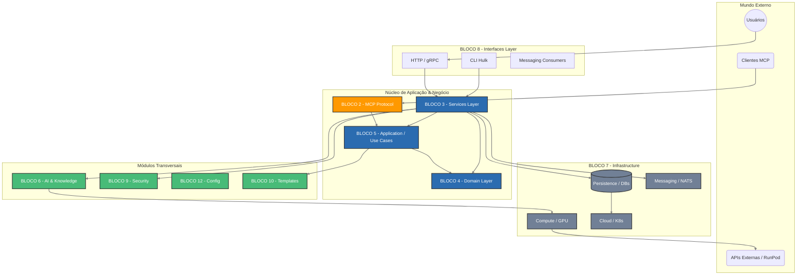
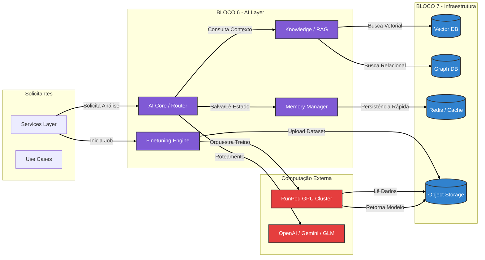
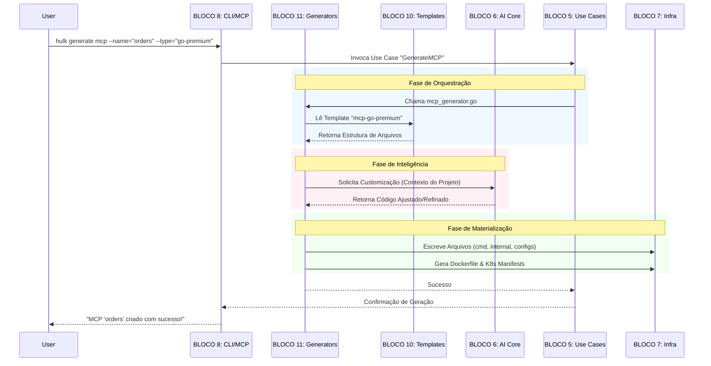

Perfeito.
Seguindo **exatamente o formato do arquivo `mcp-fulfillment-ops-INTEGRACOES-v2.md`** (colunas: **ORIGEM | INTEGRA | MOTIVO**), aqui está a **tabela oficial de integrações do BLOCO-1**.

---

# ✅ **BLOCO 1 — Integrações (Formato Oficial)**

| **ORIGEM**                         | **INTEGRA**                   | **MOTIVO**                                                                                     |
| ---------------------------------- | ----------------------------- | ---------------------------------------------------------------------------------------------- |
| **BLOCO 1 – Core / Engine / Root** | BLOCO 2 – MCP Protocol        | O núcleo inicial do Hulk precisa expor servidor/cliente MCP e iniciar pipeline de comunicação. |
| BLOCO 1 – Core                     | BLOCO 3 – Services            | Serviços de alto nível dependem do core para inicialização e orquestração.                     |
| BLOCO 1 – Core                     | BLOCO 4 – Domain              | O domínio é carregado na inicialização para registrar entidades e regras.                      |
| BLOCO 1 – Core                     | BLOCO 5 – Application         | O Core dispara os casos de uso no boot e conecta adaptadores.                                  |
| BLOCO 1 – Engine                   | BLOCO 6 – AI & RAG            | Carrega módulo de IA, memória, conhecimento e agentes especialistas na inicialização.          |
| BLOCO 1 – Engine                   | BLOCO 7 – Infrastructure      | Necessário iniciar conexões: Postgres, Redis, NATS, VectorDB, GraphDB.                         |
| BLOCO 1 – Engine                   | BLOCO 8 – Interfaces          | Registra handlers HTTP, gRPC, CLI e consumers de eventos.                                      |
| BLOCO 1 – Engine                   | BLOCO 9 – Security            | Carrega políticas de autenticação, criptografia, RBAC.                                         |
| BLOCO 1 – Config Loader            | BLOCO 12 – Configuration      | O bloco 1 consome todas as configs YAML para inicializar o sistema.                            |
| BLOCO 1 – Bootstrap                | BLOCO 13 – Scripts/Automation | Script de inicialização aciona bootstrap do Hulk.                                              |
| BLOCO 1 – Bootstrap                | BLOCO 14 – Documentation      | Documentação de arquitetura explica fluxo de boot e dependências.                              |

---

# 🔍 **Resumo técnico do BLOCO-1 para conferência**

BLOCO-1 é responsável por:

* bootstrap,
* engine principal,
* carregamento de configs,
* wiring inicial das camadas.

Portanto, ele integra com **todos os blocos**, mas por motivos **de boot**, não **de dependência funcional**.

---

Se quiser, já posso gerar **o BLOCO-2 (MCP Protocol)** no mesmo formato.

Perfeito — seguindo **exatamente o mesmo padrão oficial do arquivo v2**:

> **ORIGEM | INTEGRA | MOTIVO**

Aqui está o **BLOCO-2 — MCP PROTOCOL & GENERATION**.

---

# ✅ **BLOCO 2 — Integrações (MCP Protocol & Generation)**

| **ORIGEM**                                       | **INTEGRA**                          | **MOTIVO**                                                                   |
| ------------------------------------------------ | ------------------------------------ | ---------------------------------------------------------------------------- |
| **MCP Protocol (server/client)**                 | BLOCO 3 – Services                   | MCP chama serviços internos para responder ferramentas, ações e requisições. |
| MCP Protocol                                     | BLOCO 5 – Application (Use Cases)    | Handlers MCP disparam casos de uso (generation, template mgmt, validation).  |
| MCP Protocol                                     | BLOCO 7 – Infrastructure / Messaging | O MCP pode enviar/receber eventos via NATS para operar assíncrono.           |
| MCP Protocol                                     | BLOCO 12 – Config                    | Configurações MCP (porta, tools, clients) vêm dos YAML.                      |
| MCP Protocol                                     | BLOCO 14 – Documentation             | Documentação define tools disponíveis e comportamento MCP.                   |
| **Generators (Go, Rust, TinyGo, Web)**           | BLOCO 10 – Templates                 | Geradores usam templates-base, web, wasm, premium.                           |
| Generators                                       | BLOCO 5 – Application                | Casos de uso de geração invocam os geradores.                                |
| Generators                                       | BLOCO 4 – Domain                     | Geradores criam entidades, repositórios e serviços do domínio.               |
| Generators                                       | BLOCO 3 – Services                   | Serviços operam como orquestradores das operações de geração.                |
| Generators                                       | BLOCO 7 – Infrastructure             | Geradores podem criar arquivos de config infra (docker/k8s).                 |
| **Validators (estrutura, dependências, código)** | BLOCO 5 – Application                | Casos de uso de validação utilizam validators.                               |
| Validators                                       | BLOCO 4 – Domain                     | Validação verifica aderência das entidades/contratos do domínio.             |
| Validators                                       | BLOCO 10 – Templates                 | Validators garantem que o template gerado respeita padrões do Hulk.          |
| Validators                                       | BLOCO 12 – Config                    | Validators conferem se arquivos YAML seguem padrão esperado.                 |
| **Registry (MCP / Templates / Services)**        | BLOCO 3 – Services                   | Registry registra serviços e MCPs disponíveis.                               |
| Registry                                         | BLOCO 10 – Templates                 | Registry expõe templates registráveis ao MCP.                                |
| Registry                                         | BLOCO 8 – Interfaces (CLI/HTTP)      | Interfaces podem listar/registar MCPs via registry.                          |

---

# 🔍 **Resumo técnico do BLOCO-2**

BLOCO-2 é composto por quatro partes:

### **1. MCP Protocol**

* Protocolo base de comunicação server/client.
* Expõe ferramentas IA, geração e templates.

### **2. Generators**

* Geram código, templates, módulos, serviços, estrutura completa.

### **3. Validators**

* Garantem estrutura correta, árvore de arquivos e dependências.

### **4. Registry**

* Registra MCPs, templates e serviços para auto-descoberta.

Por isso ele integra com:

* Application (casos de uso),
* Domain (contratos e regras),
* Templates,
* Infrastructure,
* e Interfaces (CLI/HTTP).

---

Se quiser, posso continuar com **BLOCO-3 (Services Layer)**.

Boa, vamos manter exatamente o mesmo padrão.

### 🧩 Formato:

**ORIGEM | INTEGRA | MOTIVO**

---

## ✅ BLOCO 3 — SERVICES LAYER (Integrações)

| **ORIGEM**                   | **INTEGRA**                                       | **MOTIVO**                                                                                                        |
| ---------------------------- | ------------------------------------------------- | ----------------------------------------------------------------------------------------------------------------- |
| **BLOCO 3 – Services Layer** | BLOCO 4 – Domain Layer                            | Os serviços de negócio usam entidades, value objects e interfaces de repositório definidos no domínio.            |
| BLOCO 3 – Services Layer     | BLOCO 5 – Application (Use Cases)                 | Os casos de uso orquestram os serviços; serviços expõem operações de negócio consumidas pela camada de aplicação. |
| BLOCO 3 – Services Layer     | BLOCO 2 – MCP Protocol & Generation               | O `mcp_service` expõe operações de registro, geração e manipulação de MCPs para o protocolo MCP.                  |
| BLOCO 3 – Services Layer     | BLOCO 6 – AI & Knowledge                          | `ai_service` e `knowledge_service` orquestram chamadas para o módulo de IA (LLMs, RAG, memória).                  |
| BLOCO 3 – Services Layer     | BLOCO 7 – Infrastructure (Persistence)            | Serviços usam repositórios concretos (Postgres, VectorDB, GraphDB, Redis) para ler/gravar estado.                 |
| BLOCO 3 – Services Layer     | BLOCO 7 – Infrastructure (Messaging)              | Serviços publicam/consomem eventos (NATS, Kafka, RabbitMQ) para workflows assíncronos.                            |
| BLOCO 3 – Services Layer     | BLOCO 7 – Infrastructure (Compute)                | Serviços podem disparar jobs de compute intenso (ex.: fine-tuning, batch) via módulo de compute/serverless.       |
| BLOCO 3 – Services Layer     | BLOCO 9 – Security Layer                          | Serviços consultam regras de autenticação/autorização (RBAC, policies) antes de executar operações críticas.      |
| BLOCO 3 – Services Layer     | BLOCO 10 – Templates                              | `template_service` gerencia templates registrados e expõe operações de consulta/instanciação.                     |
| BLOCO 3 – Services Layer     | BLOCO 12 – Configuration                          | Serviços carregam parâmetros de negócio, limites, flags e integrações a partir dos YAML de config.                |
| BLOCO 3 – Services Layer     | BLOCO 11 – Tools & Utilities                      | Validadores e analisadores chamam serviços para validar MCPs, templates e projetos gerados.                       |
| BLOCO 3 – Services Layer     | BLOCO 8 – Interfaces (HTTP/gRPC/CLI)              | Services são a “porta de entrada” de negócio para handlers HTTP, servidores gRPC e comandos CLI.                  |
| BLOCO 3 – Monitoring Service | BLOCO 7 – Infrastructure (Monitoring/Time Series) | `monitoring_service` envia métricas, logs e traces para Prometheus/Influx/Grafana/Jaeger.                         |
| BLOCO 3 – State Service      | BLOCO 6 – AI Memory & State                       | `state_service` fornece estado consistente para AI, RAG, memória e versionamento.                                 |

Se quiser, já sigo para o **BLOCO 4 – DOMAIN LAYER** no mesmo formato.

Bora ✌️
Mesmo formato de sempre:

**ORIGEM | INTEGRA | MOTIVO**

---

## ✅ BLOCO 4 — DOMAIN LAYER (Integrações)

| **ORIGEM**                 | **INTEGRA**                            | **MOTIVO**                                                                                                                                   |
| -------------------------- | -------------------------------------- | -------------------------------------------------------------------------------------------------------------------------------------------- |
| **BLOCO 4 – Domain Layer** | BLOCO 5 – Application (Use Cases)      | A camada de aplicação orquestra os casos de uso apoiados nas regras de negócio do domínio (entidades, value objects, services de domínio).   |
| BLOCO 4 – Domain Layer     | BLOCO 3 – Services Layer               | Os serviços de negócio utilizam entidades e serviços de domínio como fonte de verdade das regras e invariantes.                              |
| BLOCO 4 – Domain Layer     | BLOCO 7 – Infrastructure (Persistence) | As interfaces de repositório do domínio são implementadas pela infraestrutura (Postgres, Vector, Graph, Cache).                              |
| BLOCO 4 – Domain Layer     | BLOCO 2 – MCP Protocol & Generation    | Generators usam entidades, value objects e interfaces do domínio como base para gerar código de MCPs e serviços.                             |
| BLOCO 4 – Domain Layer     | BLOCO 6 – AI & Knowledge               | Entidades como `Knowledge`, `Project`, `Template`, `MCP` ajudam a estruturar o que a IA lê/escreve (RAG, memória, versionamento).            |
| BLOCO 4 – Domain Layer     | BLOCO 9 – Security Layer               | Regras de domínio podem exigir validações de permissão (roles, policies) fornecidas pelo módulo de segurança.                                |
| BLOCO 4 – Domain Layer     | BLOCO 10 – Templates                   | Os templates codificam a forma canonical das entidades, repositórios e serviços de domínio que serão gerados para novos projetos.            |
| BLOCO 4 – Domain Layer     | BLOCO 12 – Configuration               | Algumas regras de domínio (limites, thresholds, modos de operação) podem ser parametrizadas via configs YAML (ex.: limites por tenant).      |
| BLOCO 4 – Domain Layer     | BLOCO 14 – Documentation               | A documentação de arquitetura e de domínio descreve entidades, agregados, invariantes e fluxos de negócio (fonte para onboarding e geração). |

Se quiser, já sigo pro **BLOCO 5 – APPLICATION LAYER (Use Cases / Ports / DTOs)** no mesmo padrão.

Perfeito — seguimos o mesmo padrão:

**ORIGEM | INTEGRA | MOTIVO**

---

# ✅ **BLOCO 5 — APPLICATION LAYER (Use Cases / Ports / DTOs)**

| **ORIGEM**                      | **INTEGRA**                             | **MOTIVO**                                                                                               |
| ------------------------------- | --------------------------------------- | -------------------------------------------------------------------------------------------------------- |
| **BLOCO 5 – Application Layer** | BLOCO 4 – Domain Layer                  | Use cases executam regras de negócio definidas no domínio (entidades, services, value objects).          |
| Application (Use Cases)         | BLOCO 3 – Services Layer                | Use cases orquestram os serviços especializados (AI, Template, Monitoring, Versionamento, Estado).       |
| Application (Use Cases)         | BLOCO 2 – MCP Protocol & Generation     | Requests vêm via MCP; casos de uso executam lógica de geração, validação e gestão de templates/MCPs.     |
| Application (Ports)             | BLOCO 7 – Infrastructure (Repositórios) | Ports definem contratos; infraestrutura fornece implementações concretas (Postgres, Redis, VectorDB).    |
| Application (Use Cases)         | BLOCO 6 – AI & Knowledge                | Use cases acionam IA (RAG, LLM, Fine-tuning) quando solicitado por serviços ou MCP.                      |
| Application (DTOs)              | BLOCO 8 – Interfaces (HTTP/gRPC/CLI)    | Handlers consomem/produzem DTOs para comunicação externa, mantendo o domínio protegido.                  |
| Application                     | BLOCO 9 – Security Layer                | Casos de uso podem exigir validação de permissões, tokens, roles e políticas.                            |
| Application                     | BLOCO 12 – Configuration                | Use cases utilizam configurações (limites, features) via YAML/ENV loaders.                               |
| Application                     | BLOCO 10 – Templates                    | Casos de uso usam templates para gerar estruturas, microserviços, MCPs e componentes.                    |
| Application                     | BLOCO 7 – Messaging                     | Use cases podem publicar eventos assíncronos (NATS, Kafka) após executar ações.                          |
| Application                     | BLOCO 11 – Validators/Analyzers         | Casos de uso de validação e análise chamam módulos de validação de estrutura, dependências e qualidade.  |
| Application                     | BLOCO 14 – Documentation                | Casos de uso são documentados em guides e blueprint de arquitetura, servindo de referência para geração. |

---

BLOCO 5 é o **coração da orquestração** — ele conecta MCP, serviços, domínio, IA, infra, templates, segurança… por isso ele tem muitas integrações diretas.

Pronto para o **BLOCO 6 – AI / Knowledge / Memory / Finetuning**?

Perfeito — vamos para o **BLOCO 6**, mantendo exatamente o formato oficial:

**ORIGEM | INTEGRA | MOTIVO**

Este é um dos blocos com MAIS integrações de todo o Hulk, então preparei a tabela de forma **clara e enxuta**, mas **completa**.

---

# ✅ **BLOCO 6 — AI LAYER (Core, Knowledge, Memory, Finetuning)**

Inclui:

* AI Core
* Knowledge / RAG
* Memory
* Finetuning (GPU externa – RunPod)

---

# 🧠 **TABELA DE INTEGRAÇÕES – BLOCO 6**

| **ORIGEM**                                          | **INTEGRA**                                 | **MOTIVO**                                                                  |
| --------------------------------------------------- | ------------------------------------------- | --------------------------------------------------------------------------- |
| **AI Core (LLM Interface, Prompt Builder, Router)** | BLOCO 3 – Services Layer                    | AI Service orquestra execução de LLMs via AI Core.                          |
| AI Core                                             | BLOCO 5 – Application Layer                 | Casos de uso acionam IA para geração, análise, classificação, explicação.   |
| AI Core                                             | BLOCO 4 – Domain Layer                      | Regras de domínio podem influenciar prompts, tipos e políticas de IA.       |
| AI Core                                             | BLOCO 7 – Infrastructure (HTTP Clients)     | A camada de infraestrutura fornece clientes para provedores externos de IA. |
| AI Core                                             | **APIs Externas (OpenAI, Gemini, GLM)**     | Execução de prompts, embeddings e raciocínio.                               |
| AI Core                                             | BLOCO 14 – Documentation                    | É documentado em AI Integration / Roteamento / Estratégias.                 |
| **AI Knowledge (RAG)**                              | BLOCO 7 – Infrastructure (VectorDB)         | Usado para recuperar informações via Qdrant / Weaviate / Pinecone.          |
| AI Knowledge                                        | BLOCO 7 – GraphDB                           | Geração e consulta de grafos de conhecimento.                               |
| AI Knowledge                                        | BLOCO 3 – Services Layer                    | Knowledge Service orquestra ingestão, indexação, retrieval.                 |
| AI Knowledge                                        | BLOCO 5 – Application                       | Use cases disparam ingestão, queries semânticas e atualizações.             |
| AI Knowledge                                        | BLOCO 4 – Domain                            | Estrutura de conhecimento (entities, models, aggregates).                   |
| AI Knowledge                                        | BLOCO 12 – Configuration                    | Parâmetros de chunking, embeddings, indexing, sync.                         |
| AI Knowledge                                        | BLOCO 14 – Documentation                    | Usado no guia RAG, no blueprint de conhecimento.                            |
| **AI Memory (Episodic/Semantic/Working)**           | BLOCO 7 – Infrastructure (Cache/Redis)      | Armazena memória volátil, sessões e contexto do agente.                     |
| AI Memory                                           | BLOCO 3 – Services                          | Memory Service consolida, reescreve e salva memórias.                       |
| AI Memory                                           | BLOCO 6 – AI Knowledge                      | Memórias consolidadas podem alimentar RAG.                                  |
| AI Memory                                           | BLOCO 5 – Application                       | Use cases consultam memória para continuidade de contexto.                  |
| AI Memory                                           | BLOCO 4 – Domain                            | Entidades representam memórias estruturadas.                                |
| AI Memory                                           | BLOCO 14 – Documentation                    | Documentação de “Memory Management” do Hulk.                                |
| **AI Finetuning**                                   | **RunPod API (GPU Externa)**                | Execução de jobs de fine-tuning em GPU remota (sem GPU local).              |
| AI Finetuning                                       | BLOCO 7 – Infrastructure (Storage/S3/MinIO) | Armazenamento de datasets, checkpoints, modelos treinados.                  |
| AI Finetuning                                       | BLOCO 3 – Services Layer                    | Finetuning Service orquestra jobs e versionamento.                          |
| AI Finetuning                                       | BLOCO 5 – Application                       | Use cases iniciam treinos, consultam status e coletam artefatos.            |
| AI Finetuning                                       | BLOCO 4 – Domain                            | Versionamento e entidades de “ModelVersion”, “Dataset”, “TrainingJob”.      |
| AI Finetuning                                       | BLOCO 12 – Configuration                    | Configs YAML determinam GPU type, provider, dataset path.                   |
| AI Finetuning                                       | BLOCO 11 – Tools & Validators               | Validadores garantem integridade de datasets e configs de treino.           |
| AI Finetuning                                       | BLOCO 14 – Documentation                    | Documentação contém guias “Finetuning RunPod” e “External GPU”.             |

---

# 🧩 **Resumo técnico — BLOCO 6**

O BLOCO 6 é dividido em quatro módulos fortemente integrados:

### **1️⃣ AI Core**

* Fala diretamente com provedores externos (OpenAI, Gemini, GLM).
* É acionado via Services e Use Cases.

### **2️⃣ AI Knowledge (RAG)**

* Depende de VectorDB, GraphDB e Storage.
* Serve de base para IA contextualizada.

### **3️⃣ AI Memory**

* Usa Redis/Cache para gerenciamento de estado cognitivo.
* Alimenta e é alimentado pelo RAG.

### **4️⃣ AI Finetuning**

* Execução 100% em GPU externa (RunPod).
* Versionamento + datasets + storage + orquestração.

---

Se quiser, sigo agora com o **BLOCO 7 – INFRASTRUCTURE LAYER** no mesmo padrão.

Bora pro **BLOCO 7 – INFRASTRUCTURE LAYER**, no mesmo formato:

> **ORIGEM | INTEGRA | MOTIVO**

---

## ✅ BLOCO 7 — INFRASTRUCTURE LAYER (Persistence, Messaging, Compute, Network, Cloud)

| **ORIGEM**                                                                    | **INTEGRA**                            | **MOTIVO**                                                                                                             |
| ----------------------------------------------------------------------------- | -------------------------------------- | ---------------------------------------------------------------------------------------------------------------------- |
| **BLOCO 7 – Infrastructure**                                                  | BLOCO 3 – Services Layer               | Os serviços de negócio precisam de implementações concretas de repositórios, mensageria, cache e monitoramento.        |
| Infrastructure / Persistence (Postgres, Vector, Graph, Document, Time Series) | BLOCO 4 – Domain Layer                 | Implementa as interfaces de repositório do domínio para armazenar entidades, conhecimento, eventos e projeções.        |
| Infrastructure / Persistence                                                  | BLOCO 5 – Application Layer (Ports)    | Satisfaz os ports da camada de aplicação, permitindo que use cases leiam e gravem dados de forma abstrata.             |
| Infrastructure / Persistence                                                  | BLOCO 6 – AI Knowledge & Memory        | Fornece acesso a VectorDB, GraphDB, DocumentDB e Time Series usados por RAG, memória e analytics de IA.                |
| Infrastructure / Persistence                                                  | BLOCO 10 – Templates                   | Templates gerados assumem estes providers de storage como padrão (Postgres, Redis, VectorDB, etc.).                    |
| Infrastructure / Persistence                                                  | BLOCO 12 – Configuration               | Configurações de conexão, pools, timeouts e credenciais são lidas dos YAML de infraestrutura.                          |
| **Infrastructure / Distributed Cache (Redis, Memcached, Hazelcast)**          | BLOCO 6 – AI Memory                    | Usado para memória episódica, working memory e caching de contexto.                                                    |
| Distributed Cache                                                             | BLOCO 3 – Services Layer               | Serviços utilizam cache para otimizar leituras frequentes e reduzir carga em bancos.                                   |
| Distributed Cache                                                             | BLOCO 5 – Application                  | Use cases podem usar cache para resultados de queries pesadas.                                                         |
| **Infrastructure / Messaging (NATS, Kafka, RabbitMQ, Pub/Sub)**               | BLOCO 3 – Services Layer               | Serviços publicam e consomem eventos para workflows assíncronos (ex.: geração, sync, monitoramento).                   |
| Messaging                                                                     | BLOCO 5 – Application                  | Use cases disparam eventos após ações de negócio, integrando com outros módulos.                                       |
| Messaging                                                                     | BLOCO 2 – MCP Protocol                 | MCP pode enviar/receber comandos e eventos via NATS/Kafka para operar em modo assíncrono.                              |
| Messaging                                                                     | BLOCO 13 – Scripts & Automation        | Scripts de deploy e validação podem usar mensageria para health-check e testes de fluxo.                               |
| **Infrastructure / Compute (CPU, Distributed, Serverless)**                   | BLOCO 6 – AI Finetuning                | Orquestra jobs intensivos de compute (fine-tuning, batch) usando CPU local e chamadas para GPU externa.                |
| Compute / Serverless                                                          | BLOCO 3 – Services Layer               | Serviços podem disparar funções serverless (ex.: pipelines de processamento, notificações).                            |
| Compute / Distributed (Ray, Dask, Spark)                                      | BLOCO 5 – Application                  | Use cases de alto volume podem distribuir tarefas de processamento em clusters.                                        |
| **Infrastructure / Network (Load Balancer, CDN, Security)**                   | BLOCO 8 – Interfaces Layer (HTTP/gRPC) | Configura balanceamento de carga, TLS/SSL, WAF, rate limiting e CDN para as interfaces expostas.                       |
| Network / Security                                                            | BLOCO 9 – Security Layer               | Implementa WAF, proteção DDoS, policies de rede e terminação SSL que complementam as regras de segurança de aplicação. |
| **Infrastructure / Cloud (Kubernetes, Docker, Registries)**                   | BLOCO 13 – Scripts & Automation        | Scripts de deploy utilizam clientes K8s/Docker para subir e gerenciar o Hulk em ambientes cloud.                       |
| Cloud                                                                         | BLOCO 10 – Templates                   | Templates já vêm com manifests Docker/K8s alinhados aos componentes de infraestrutura.                                 |
| Cloud                                                                         | BLOCO 14 – Documentation               | Documentação de deployment e arquitetura cloud descreve como a infraestrutura deve ser usada.                          |
| **Infrastructure / Monitoring (Prometheus, Influx, Jaeger, etc.)**            | BLOCO 3 – Monitoring Service           | Recebe métricas, logs e traces enviados pelos serviços do Hulk.                                                        |
| Monitoring                                                                    | BLOCO 6 – AI Core & Finetuning         | Coleta métricas de latência, throughput, custo, uso de GPU/CPU e qualidade de respostas.                               |
| Monitoring                                                                    | BLOCO 12 – Configuration               | Configura endpoints, scraping, exporters e SLOs via YAML.                                                              |
| Monitoring                                                                    | BLOCO 14 – Documentation               | Serve de base para guias de observabilidade, dashboards e alertas.                                                     |

Se quiser, sigo agora com o **BLOCO 8 – INTERFACES LAYER (HTTP, gRPC, CLI, Messaging Handlers)** no mesmo formato.

Boa, vamos pro **BLOCO 8 – INTERFACES LAYER**, no mesmo padrão:

> **ORIGEM | INTEGRA | MOTIVO**

Lembrando: BLOCO 8 cobre **HTTP, gRPC, CLI e consumidores de mensagens**.

---

## ✅ BLOCO 8 — INTERFACES LAYER (HTTP / gRPC / CLI / Messaging)

| **ORIGEM**                                    | **INTEGRA**                                                  | **MOTIVO**                                                                                                                                                  |
| --------------------------------------------- | ------------------------------------------------------------ | ----------------------------------------------------------------------------------------------------------------------------------------------------------- |
| **BLOCO 8 – Interfaces Layer**                | BLOCO 3 – Services Layer                                     | Handlers HTTP/gRPC e comandos CLI chamam os services para executar regras de negócio e operações de IA, templates, monitoramento, estado.                   |
| Interfaces HTTP                               | BLOCO 5 – Application Layer (Use Cases / DTOs)               | Handlers HTTP usam DTOs para converter requests/responses em estruturas que os casos de uso entendem, isolando o domínio de detalhes de transporte.         |
| Interfaces HTTP                               | BLOCO 7 – Infrastructure / Network (LB, WAF, TLS)            | Requisições HTTP passam por load balancer, TLS/SSL, WAF e rate limiter configurados na infraestrutura de rede.                                              |
| Interfaces HTTP                               | BLOCO 9 – Security Layer (Auth, RBAC)                        | Middleware HTTP (auth, rate_limit, logging) aplica autenticação, autorização e políticas de acesso antes de alcançar os services.                           |
| Interfaces HTTP                               | BLOCO 12 – Configuration                                     | Handlers e middlewares leem configs de porta, CORS, limites de request, autenticação e features de API.                                                     |
| Interfaces HTTP                               | BLOCO 14 – Documentation (API / Guides)                      | Documentação OpenAPI/REST descreve os endpoints HTTP expostos pelos handlers do Hulk.                                                                       |
| **Interfaces gRPC**                           | BLOCO 3 – Services Layer                                     | Serviços gRPC invocam os mesmos services de negócio que o HTTP, oferecendo interface binária para integrações de alta performance.                          |
| Interfaces gRPC                               | BLOCO 5 – Application Layer                                  | Casos de uso podem ser expostos via gRPC para outros serviços internos/externos consumirem.                                                                 |
| Interfaces gRPC                               | BLOCO 7 – Infrastructure / Network                           | Infraestrutura cuida de TLS, load balancing e observabilidade para os serviços gRPC.                                                                        |
| Interfaces gRPC                               | BLOCO 9 – Security Layer                                     | Aplicam autenticação/autorização via interceptors gRPC (tokens, certificados, RBAC).                                                                        |
| Interfaces gRPC                               | BLOCO 14 – Documentation (gRPC Docs)                         | Documentação gRPC descreve serviços, métodos e mensagens expostas.                                                                                          |
| **CLI (Comandos Hulk)**                       | BLOCO 3 – Services Layer                                     | Comandos CLI (`generate`, `template`, `ai`, `monitor`, `state`, `version`) chamam services para gerar MCPs, templates, rodar validações e consultar estado. |
| CLI                                           | BLOCO 5 – Application Layer                                  | CLI é um adaptador que aciona casos de uso diretamente (ex.: `generate_mcp`, `validate_project`).                                                           |
| CLI                                           | BLOCO 10 – Templates                                         | Comandos `generate` usam templates para criar novos projetos/módulos.                                                                                       |
| CLI                                           | BLOCO 11 – Tools & Utilities                                 | CLI aciona geradores, validadores, conversores (OpenAPI/AsyncAPI, NATS schema).                                                                             |
| CLI                                           | BLOCO 12 – Configuration                                     | CLI lê configs de ambiente, paths de templates, providers habilitados e features.                                                                           |
| CLI                                           | BLOCO 13 – Scripts & Automation                              | Scripts de automação podem chamar comandos CLI como parte de pipelines de setup, deploy, validação e geração.                                               |
| CLI                                           | BLOCO 14 – Documentation (Guides)                            | Documentação de CLI lista comandos, parâmetros, exemplos e fluxos recomendados.                                                                             |
| **Messaging Handlers (Consumers de eventos)** | BLOCO 7 – Infrastructure / Messaging (NATS, Kafka, RabbitMQ) | Consumers são conectados a tópicos/filas configurados na infraestrutura de mensageria.                                                                      |
| Messaging Handlers                            | BLOCO 3 – Services Layer                                     | Ao receber eventos (MCP, AI, monitoring, system), os handlers chamam services para processar, atualizar estado, acionar IA ou enviar novos eventos.         |
| Messaging Handlers                            | BLOCO 5 – Application Layer                                  | Podem acionar casos de uso assíncronos (ex.: reprocessar fila, rebuild de projeções, sync de knowledge).                                                    |
| Messaging Handlers                            | BLOCO 6 – AI Layer                                           | Eventos podem disparar ações de IA (processar feedback, reindexar conhecimento, rodar análise).                                                             |
| Messaging Handlers                            | BLOCO 9 – Security Layer                                     | Podem aplicar checagens de origem, assinatura, policies de segurança em eventos sensíveis.                                                                  |
| Messaging Handlers                            | BLOCO 12 – Configuration                                     | Mapeamento de tópicos, filas, grupos de consumidores e limites de concorrência vem dos YAML de infra/messaging.                                             |
| Messaging Handlers                            | BLOCO 14 – Documentation                                     | Documentação AsyncAPI e guias de eventos descrevem quais eventos são consumidos e produzidos.                                                               |

---

Se você quiser, sigo com o **BLOCO 9 – SECURITY LAYER (auth, encryption, RBAC)** no mesmo padrão de integrações.

Perfeito — aqui está o **BLOCO 9 – SECURITY LAYER**, seguindo exatamente o padrão:

> **ORIGEM | INTEGRA | MOTIVO**

Lembrando: BLOCO 9 inclui **auth**, **tokens**, **certificados**, **criptografia**, **RBAC** e **policy enforcement**.

---

# ✅ **BLOCO 9 — SECURITY LAYER (Auth, Encryption, RBAC)**

| **ORIGEM**                         | **INTEGRA**                             | **MOTIVO**                                                                                                    |
| ---------------------------------- | --------------------------------------- | ------------------------------------------------------------------------------------------------------------- |
| **Security / Auth Manager**        | BLOCO 8 – Interfaces (HTTP / gRPC)      | Camada de entrada usa auth para validar tokens, sessões e credenciais antes de chamar serviços.               |
| Security / Auth Manager            | BLOCO 3 – Services Layer                | Services verificam permissões e credenciais via Auth Manager quando a operação exige confiança ou identidade. |
| Security / Auth Manager            | BLOCO 5 – Application Layer             | Use cases podem exigir autenticação/autorização antes de executar uma ação crítica.                           |
| Security / Auth Manager            | BLOCO 12 – Configuration                | Configs definem provedores de auth, chaves, expiração, cookies, JWT secret, OAuth config.                     |
| Security / Auth Manager            | BLOCO 14 – Documentation                | Documentação descreve fluxos de login, tokens, OAuth e boas práticas.                                         |
| **Security / Token Manager**       | BLOCO 8 – Interfaces (HTTP / gRPC)      | Middlewares usam o token manager para verificar, renovar ou invalidar tokens.                                 |
| Token Manager                      | BLOCO 3 – Services Layer                | Services verificam tokens em operações sensíveis (edição, deleção, ações administrativas).                    |
| Token Manager                      | BLOCO 12 – Configuration                | Configurações definem tipo de token (JWT, session), expirations, refresh tokens.                              |
| **Security / Session Manager**     | BLOCO 8 – Interfaces                    | Gerencia sessões de usuários, track de contexto, revogação e limites de uso.                                  |
| Session Manager                    | BLOCO 6 – AI Memory                     | Sessões podem influenciar contexto de IA (memória contextual, histórico de interação).                        |
| **Security / OAuth Handler**       | BLOCO 8 – Interfaces (HTTP)             | Handler HTTP redireciona fluxo OAuth (Google, GitHub, Azure).                                                 |
| OAuth Handler                      | BLOCO 12 – Configuration                | Credentials, client_id, client_secret e redirect URLs vêm das configs.                                        |
| OAuth Handler                      | BLOCO 14 – Documentation                | Documentação explica fluxos OAuth, permissões e integração cloud.                                             |
| **Security / Encryption Manager**  | BLOCO 7 – Infrastructure (Persistence)  | Dados sensíveis são criptografados antes de serem persistidos (ex.: secrets, tokens, chaves, sessões).        |
| Encryption Manager                 | BLOCO 3 – Services Layer                | Services usam criptografia para proteger dados sensíveis durante operações de negócio.                        |
| Encryption Manager                 | BLOCO 12 – Configuration                | Config define algoritmos, chaves, key rotation, KMS externo.                                                  |
| Encryption Manager                 | KMS Externo (AWS KMS / GCP KMS / Vault) | Possibilidade de armazenar chaves fora do sistema.                                                            |
| **Security / Key Manager**         | BLOCO 12 – Configuration                | Chaves simétricas/assimétricas carregadas via YAML/env.                                                       |
| Key Manager                        | BLOCO 7 – Cloud                         | Pode integrar com vaults e KMS.                                                                               |
| **Security / Certificate Manager** | BLOCO 7 – Network / TLS                 | Fornece certificados para HTTPS, mTLS e comunicação segura entre serviços.                                    |
| Certificate Manager                | BLOCO 14 – Documentation                | Documentação de SSL, rotinas de rotação e segurança de rede.                                                  |
| **Security / Secure Storage**      | BLOCO 7 – Persistence                   | Guarda segredos, tokens e credenciais de forma segura.                                                        |
| Secure Storage                     | BLOCO 3 – Services Layer                | Services acessam informações sensíveis de forma criptografada.                                                |
| **Security / RBAC Manager**        | BLOCO 3 – Services Layer                | Services consultam RBAC para validar permissões.                                                              |
| RBAC Manager                       | BLOCO 5 – Application Layer             | Use cases checam roles antes de executar operações.                                                           |
| RBAC Manager                       | BLOCO 8 – Interfaces                    | Middlewares aplicam permissões por endpoint/rota.                                                             |
| RBAC Manager                       | BLOCO 12 – Configuration                | Policies e roles são definidas/configuradas via YAML.                                                         |
| **Security / Permission Checker**  | BLOCO 3 – Services                      | Verificação em tempo de execução das permissões do usuário.                                                   |
| Permission Checker                 | BLOCO 5 – Application                   | Protege casos de uso sensíveis.                                                                               |
| **Security / Role Manager**        | BLOCO 12 – Configuration                | Carrega roles e associações usuário→role.                                                                     |
| **Security / Policy Enforcer**     | BLOCO 3 – Services Layer                | Enforce de políticas (ex.: limitações, auditoria, regra de negócio sensível).                                 |
| Policy Enforcer                    | BLOCO 8 – Interfaces                    | Proteção adicional ao expor endpoints.                                                                        |

---

Se quiser, já parto para o **BLOCO 10 – Templates** no mesmo formato.

Fechou, vamos pro **BLOCO 10 – TEMPLATES**, seguindo exatamente o padrão:

> **ORIGEM | INTEGRA | MOTIVO**

Lembrando: aqui entram **templates base (Clean Arch), Go, TinyGo, WASM, Web/React, MCP Go Premium**.

---

## ✅ BLOCO 10 — TEMPLATES (Base, Go, TinyGo, WASM, Web, MCP Premium)

| **ORIGEM**                       | **INTEGRA**                                                    | **MOTIVO**                                                                                                                  |
| -------------------------------- | -------------------------------------------------------------- | --------------------------------------------------------------------------------------------------------------------------- |
| **Templates/Base (Clean Arch)**  | BLOCO 4 – Domain Layer                                         | O template base define estrutura de entidades, value objects e repositórios seguindo o domínio padrão (Clean Architecture). |
| Templates/Base                   | BLOCO 5 – Application Layer                                    | Gera use cases, ports e DTOs pré-estruturados para novos serviços/projetos seguindo o padrão Hulk/Vertikon.                 |
| Templates/Base                   | BLOCO 7 – Infrastructure Layer                                 | Inclui estrutura padrão de repositórios, clients de banco, mensageria, HTTP, cache e config de observabilidade.             |
| Templates/Base                   | BLOCO 8 – Interfaces Layer                                     | Já traz handlers HTTP/gRPC e estrutura mínima de CLI para os serviços gerados.                                              |
| Templates/Base                   | BLOCO 2 – MCP Generators                                       | É consumido pelos geradores de MCP/serviço para criar novos módulos automaticamente.                                        |
| Templates/Base                   | BLOCO 12 – Configuration                                       | Inclui arquivos de config `dev/prod/test` e padrões de features/infra.                                                      |
| Templates/Base                   | BLOCO 14 – Documentation                                       | É referenciado na doc como “template canônico” de serviço Hulk.                                                             |
| **Templates/Go (Completo)**      | BLOCO 2 – MCP Generators                                       | Geradores usam o template Go completo para instanciar novos serviços MCP-ready com stack Hulk.                              |
| Templates/Go                     | BLOCO 3 – Services Layer                                       | Estrutura services em Go prontos para integrar com o core do Hulk.                                                          |
| Templates/Go                     | BLOCO 4 – Domain Layer                                         | Idem ao Base, mas focado em Go puro com layout definitivo de domínios.                                                      |
| Templates/Go                     | BLOCO 7 – Infrastructure                                       | Já traz Dockerfile, docker-compose, manifests K8s e integração com Postgres/Redis/NATS.                                     |
| Templates/Go                     | BLOCO 8 – Interfaces                                           | Handlers HTTP/gRPC já vêm prontos com rotas, middlewares e contrato padrão.                                                 |
| Templates/Go                     | BLOCO 11 – Tools & Validators                                  | Validadores checam se projetos gerados a partir do template Go seguem a árvore e padrões.                                   |
| **Templates/TinyGo (WASM)**      | BLOCO 2 – MCP Generators                                       | Geradores MCP usam esse template para criar módulos compilados em TinyGo/WASM.                                              |
| Templates/TinyGo                 | BLOCO 6 – AI / Agents (quando usados em edge/embutido)         | Podem ser usados como componentes leves em ambientes restritos / edge.                                                      |
| Templates/TinyGo                 | BLOCO 7 – Infrastructure / Web                                 | Integram com web front via WASM loader.                                                                                     |
| **Templates/WASM (Rust)**        | BLOCO 2 – MCP Generators                                       | Geradores podem usar o template Rust/WASM para criar módulos de alto desempenho.                                            |
| Templates/WASM                   | BLOCO 7 – Infrastructure / Web                                 | Servidos via HTTP/CDN, integrados com front React/Vite.                                                                     |
| **Templates/Web (React/Vite)**   | BLOCO 8 – Interfaces (Front-end)                               | Fornecem UI padrão (admin, dashboards, forms) para operar MCPs, AI e serviços do Hulk.                                      |
| Templates/Web                    | BLOCO 3 – Services Layer (APIs)                                | A Web consome APIs definidas pelos handlers HTTP/gRPC gerados nos templates Go/Base.                                        |
| Templates/Web                    | BLOCO 12 – Configuration                                       | Usa configs (endpoint APIs, feature flags) definidas em YAML/JSON ou env.                                                   |
| Templates/Web                    | BLOCO 14 – Documentation                                       | Exemplo de UI de referência para projetos Hulk.                                                                             |
| **Template MCP Go Premium (v5)** | BLOCO 6 – AI (Core, RAG, Finetuning, Memory, Learning)         | Este template já vem com todas as integrações premium de IA, memória, RAG, versionamento e feedback loop.                   |
| Template MCP Go Premium          | BLOCO 7 – Infrastructure (NATS, VectorDB, GraphDB, Monitoring) | Inclui stack pronta com NATS, VectorDB, GraphDB, tracing, métricas e logs estruturados.                                     |
| Template MCP Go Premium          | BLOCO 3 – Services Layer                                       | Define services avançados (AI, State, Monitoring, Versioning) seguindo padrão premium.                                      |
| Template MCP Go Premium          | BLOCO 2 – MCP Protocol                                         | Nasce MCP-ready, com server/client e tools integrados.                                                                      |
| Template MCP Go Premium          | BLOCO 11 – Tools & Deployers                                   | É o principal alvo dos geradores/validators/deployers, pensado para produção de alta performance.                           |
| Template MCP Go Premium          | BLOCO 12 – Configuration                                       | Vem com configs avançadas de AI, state, infra, monitoring, versionamento e segurança.                                       |
| Template MCP Go Premium          | BLOCO 14 – Documentation                                       | Referenciado como o blueprint de “MCP Hulk Premium” nos docs de arquitetura.                                                |

---

Se você quiser, posso seguir com:

* **BLOCO 11 – TOOLS & UTILITIES**,
* depois **BLOCO 12 – CONFIGURATION**,
* **BLOCO 13 – SCRIPTS & AUTOMATION**,
* e fechar com **BLOCO 14 – DOCUMENTATION**, tudo nesse mesmo formato de integrações.

Bora fechar o ciclo 😎
Mesma estrutura:

> **ORIGEM | INTEGRA | MOTIVO**

---

## ✅ BLOCO 11 — TOOLS & UTILITIES (Generators, Validators, Converters, Analyzers, Deployers)

| **ORIGEM**                                                         | **INTEGRA**                           | **MOTIVO**                                                                                                 |
| ------------------------------------------------------------------ | ------------------------------------- | ---------------------------------------------------------------------------------------------------------- |
| **Tools / Generators (mcp/template/code/config)**                  | BLOCO 2 – MCP Protocol & Generation   | Os generators são a “mão” operacional do MCP: recebem comandos MCP/CLI e geram código, configs e projetos. |
| Tools / Generators                                                 | BLOCO 10 – Templates                  | Usam os templates (base, Go, TinyGo, WASM, Web, Premium) como fonte para gerar novos projetos e módulos.   |
| Tools / Generators                                                 | BLOCO 5 – Application (Use Cases)     | Casos de uso de geração (`mcp_generation`, `template_management`) chamam diretamente os generators.        |
| Tools / Generators                                                 | BLOCO 7 – Infrastructure              | Podem criar arquivos de infra (Dockerfile, docker-compose, manifests K8s, configs de messaging).           |
| Tools / Generators                                                 | BLOCO 12 – Configuration              | Lêem configs de geração (paths de template, flags, providers) e podem gerar configs derivadas.             |
| Tools / Generators                                                 | BLOCO 8 – CLI                         | A CLI expõe comandos (`generate_mcp`, `generate_template`, etc.) que usam diretamente os generators.       |
| **Tools / Validators (mcp/template/code/config)**                  | BLOCO 2 – MCP Protocol & Generation   | MCP pode expor tools de validação (ex.: “validate_project”, “validate_mcp”).                               |
| Tools / Validators                                                 | BLOCO 5 – Application                 | Use cases de validação chamam validators para garantir aderência a padrões.                                |
| Tools / Validators                                                 | BLOCO 4 – Domain                      | Validam se o modelo/domínio gerado está aderente às regras (entidades, repositórios, serviços).            |
| Tools / Validators                                                 | BLOCO 10 – Templates                  | Conferem se templates não foram corrompidos e seguem a árvore/política de estrutura.                       |
| Tools / Validators                                                 | BLOCO 12 – Configuration              | Validam configs YAML (tipos, ranges, chaves obrigatórias).                                                 |
| Tools / Validators                                                 | BLOCO 13 – Scripts                    | Scripts de validação usam esses validators como backend.                                                   |
| **Tools / Converters (schema, NATS, OpenAPI, AsyncAPI)**           | BLOCO 7 – Infrastructure (Messaging)  | `nats_schema_generator` e outros convertem schemas para configs de mensageria.                             |
| Tools / Converters                                                 | BLOCO 8 – Interfaces                  | `openapi_generator`, `asyncapi_generator` geram specs para HTTP/Events.                                    |
| Tools / Converters                                                 | BLOCO 14 – Documentation              | Especificações OpenAPI/AsyncAPI são base para docs de APIs e eventos.                                      |
| **Tools / Analyzers (performance, security, dependency, quality)** | BLOCO 3 – Services Layer              | Analisam serviços e suas dependências (performance, segurança, acoplamento).                               |
| Tools / Analyzers                                                  | BLOCO 7 – Infrastructure              | Medem impacto de infra (latência, throughput, gargalos).                                                   |
| Tools / Analyzers                                                  | BLOCO 6 – AI Layer                    | Podem medir qualidade de respostas, custo de IA, latência de LLMs.                                         |
| Tools / Analyzers                                                  | BLOCO 12 – Configuration              | Podem sugerir ajustes em configs com base em análises.                                                     |
| Tools / Analyzers                                                  | BLOCO 14 – Documentation / Validation | Geração de relatórios de qualidade/validação para docs.                                                    |
| **Tools / Deployers (K8s, Docker, Serverless, Hybrid)**            | BLOCO 7 – Infrastructure / Cloud      | São wrappers inteligentes para deploy em Kubernetes, Docker e Serverless.                                  |
| Tools / Deployers                                                  | BLOCO 13 – Scripts & Automation       | Scripts de deploy invocam estes deployers.                                                                 |
| Tools / Deployers                                                  | BLOCO 12 – Configuration              | Lêem configs de ambientes (dev/staging/prod) para decidir como e onde deployar.                            |
| Tools / Deployers                                                  | BLOCO 14 – Documentation              | Fluxos de deploy documentados em “deployment.md” fazem referência aos deployers.                           |

---

## ✅ BLOCO 12 — CONFIGURATION (YAMLs de Core, AI, State, Infra, Templates, Envs, Features)

| **ORIGEM**                                                                       | **INTEGRA**                         | **MOTIVO**                                                                                      |
| -------------------------------------------------------------------------------- | ----------------------------------- | ----------------------------------------------------------------------------------------------- |
| **Configuration / Core (engine, cache, metrics, security)**                      | BLOCO 1 – Core / Engine             | O boot do Hulk usa essas configs para subir engine, cache, métricas e segurança básica.         |
| Configuration / Core                                                             | BLOCO 3 – Services                  | Services leem limites, timeouts, políticas e parâmetros de engine/cache.                        |
| Configuration / Core                                                             | BLOCO 7 – Infrastructure            | Infra lê configs de pool, TTLs, endpoints de metrics, etc.                                      |
| **Configuration / AI (models, knowledge, memory, learning)**                     | BLOCO 6 – AI Layer                  | Define quais modelos usar, parâmetros de RAG/memória, provedores IA, modos de fine-tuning.      |
| Configuration / AI                                                               | BLOCO 3 – Services Layer            | AI Service carrega configs de comportamento (modo safe, provider preferido, limites de custos). |
| **Configuration / State (store, events, cache)**                                 | BLOCO 3 – State Service             | Controla onde e como estado/eventos são armazenados (Postgres, Redis, NATS).                    |
| Configuration / State                                                            | BLOCO 7 – Persistence & Messaging   | Ajusta conexões, retention, partições, streams.                                                 |
| **Configuration / Monitoring (observability, analytics, health, alerting)**      | BLOCO 7 – Monitoring Infrastructure | Diz onde mandar métricas/logs/traces e como configurar healthchecks/alertas.                    |
| Configuration / Monitoring                                                       | BLOCO 3 – Monitoring Service        | Service envia dados conforme regras e destinos definidos aqui.                                  |
| **Configuration / Versioning (knowledge, models, data)**                         | BLOCO 6 – AI (RAG + Finetuning)     | Controla políticas de versionamento de conhecimento, modelos e datasets.                        |
| Configuration / Versioning                                                       | BLOCO 3 – Versioning Service        | Define fluxos de promotion, rollback, retenção.                                                 |
| **Configuration / Infrastructure (storage, messaging, compute, network, cloud)** | BLOCO 7 – Infrastructure Layer      | É a base das conexões: Postgres, Redis, VectorDB, Messaging, Compute, Cloud providers.          |
| Configuration / Infrastructure                                                   | BLOCO 13 – Scripts & Automation     | Scripts usam essas configs para provisionar, testar e deployar ambientes.                       |
| **Configuration / Templates (base, go, tinygo, wasm, web)**                      | BLOCO 10 – Templates                | Define caminhos, opções, features e presets para cada template.                                 |
| Configuration / Templates                                                        | BLOCO 11 – Generators               | Generators leem qual template usar, com quais parâmetros e variações.                           |
| **Configuration / Environments (dev, staging, prod, test)**                      | TODOS OS BLOCOS                     | Controlam variações por ambiente (URLs, chaves, limites, modos de debug).                       |
| Configuration / Environments                                                     | BLOCO 8 – Interfaces                | Define bases de URL, CORS, autenticação por ambiente.                                           |
| **Configuration / features.yaml**                                                | BLOCO 1 – Core / Feature Flags      | Liga/desliga features do Hulk (AI premium, finetuning externo, integrações específicas).        |
| features.yaml                                                                    | BLOCO 3 – Services                  | Services podem condicionar comportamentos a feature flags.                                      |
| features.yaml                                                                    | BLOCO 10 – Templates                | Templates podem ser gerados com features específicas ativadas/desativadas.                      |

---

## ✅ BLOCO 13 — SCRIPTS & AUTOMATION (Setup, Deploy, Geração, Validação, Otimização, Manutenção)

| **ORIGEM**                                                               | **INTEGRA**                         | **MOTIVO**                                                                                   |
| ------------------------------------------------------------------------ | ----------------------------------- | -------------------------------------------------------------------------------------------- |
| **Scripts / Setup (*setup_*.sh)**                                        | BLOCO 7 – Infrastructure            | Automatizam provisionamento de infra (bancos, messaging, monitoring, cloud resources).       |
| Scripts / Setup                                                          | BLOCO 6 – AI Layer                  | Podem preparar ambientes de AI (chaves de API, storage de datasets, integrações com RunPod). |
| Scripts / Setup                                                          | BLOCO 12 – Configuration            | Lêem configs para saber o que provisionar em cada ambiente (dev/stage/prod).                 |
| **Scripts / Deployment (*deploy_*.sh / rollback.sh)**                    | BLOCO 7 – Cloud / Compute           | Executam deploy em Docker/K8s/Serverless/Hybrid, usando clients de infra.                    |
| Scripts / Deployment                                                     | BLOCO 11 – Deployers                | São o “wrapper” de automação chamando os deployers em Go.                                    |
| Scripts / Deployment                                                     | BLOCO 3 – Services Layer            | Deployam serviços de negócio e MCPs.                                                         |
| **Scripts / Generation (*generate_*.sh)**                                | BLOCO 11 – Generators               | Automatizam geração de MCPs, templates, configs e documentação.                              |
| Scripts / Generation                                                     | BLOCO 2 – MCP Protocol & Generation | Podem acionar MCP para geração por tools MCP em vez de CLI pura.                             |
| **Scripts / Validation (*validate_*.sh)**                                | BLOCO 11 – Validators               | Executam validação de MCPs, templates, config e infraestrutura usando os validators do Hulk. |
| Scripts / Validation                                                     | BLOCO 12 – Configuration            | Conferem se configs estão corretas por ambiente.                                             |
| **Scripts / Optimization (*optimize_*.sh)**                              | BLOCO 7 – Infrastructure / Compute  | Rodam rotinas de otimização de performance, cache, DB, rede e IA.                            |
| Scripts / Optimization                                                   | BLOCO 6 – AI Layer                  | Podem otimizar inferência, cache de prompts, roteamento de modelos.                          |
| **Scripts / Maintenance (backup, cleanup, health, update_dependencies)** | BLOCO 7 – Persistence/Infra         | Automatizam backup, limpeza, health-check e atualização de dependências infra.               |
| Scripts / Maintenance                                                    | BLOCO 3 – Services Layer            | Podem verificar saúde de serviços e fazer ações de manutenção.                               |
| Scripts / Maintenance                                                    | BLOCO 14 – Documentation            | São referenciados nos guias de operação e troubleshooting.                                   |

---

## ✅ BLOCO 14 — DOCUMENTATION (Architecture, AI, State, Monitoring, Versioning, API, Guides, Examples, Validation)

| **ORIGEM**                                                                                                                | **INTEGRA**                                               | **MOTIVO**                                                                                                  |
| ------------------------------------------------------------------------------------------------------------------------- | --------------------------------------------------------- | ----------------------------------------------------------------------------------------------------------- |
| **Documentation / Architecture**                                                                                          | TODOS OS BLOCOS (1–13)                                    | Descreve a arquitetura, responsabilidades e relações entre os blocos do Hulk (fonte de verdade conceitual). |
| Documentation / Architecture                                                                                              | BLOCO 2 – MCP & BLOCO 10 – Templates                      | Serve como base para ajustes de templates e de MCPs gerados (padrão de arquitetura).                        |
| **Documentation / AI**                                                                                                    | BLOCO 6 – AI Layer                                        | Explica integração de IA, RAG, memória, aprendizado e especialização.                                       |
| Documentation / AI                                                                                                        | BLOCO 3 – Services & BLOCO 5 – Application                | Mostra como os serviços e casos de uso conversam com a IA.                                                  |
| **Documentation / State**                                                                                                 | BLOCO 3 – State Service                                   | Descreve modelo de estado distribuído, event sourcing e projections.                                        |
| Documentation / State                                                                                                     | BLOCO 7 – Persistence/Messaging                           | Explica como bancos e mensageria suportam event sourcing e sync.                                            |
| **Documentation / Monitoring**                                                                                            | BLOCO 3 – Monitoring Service & BLOCO 7 – Monitoring Infra | Define padrões de métricas, logs, traces, dashboards e alertas.                                             |
| **Documentation / Versioning**                                                                                            | BLOCO 6 – AI Finetuning & Knowledge                       | Explica versionamento de modelos, datasets e conhecimento (RAG).                                            |
| Documentation / Versioning                                                                                                | BLOCO 3 – Versioning Service                              | Orquestra os fluxos de versionamento descritos nos docs.                                                    |
| **Documentation / API (OpenAPI, AsyncAPI, gRPC)**                                                                         | BLOCO 8 – Interfaces Layer                                | Especifica HTTP, eventos e gRPC expostos pelo Hulk.                                                         |
| Documentation / API                                                                                                       | BLOCO 11 – Converters (openapi/asyncapi)                  | É consumida/gerada parcialmente pelos conversores.                                                          |
| **Documentation / Guides (getting_started, development, deployment, cli, ai_rag, fine_tuning_cycle, using_external_gpu)** | BLOCO 1 – Core & Dev Experience                           | Guiam o uso correto do Hulk desde o setup até operações avançadas de IA e GPU externa.                      |
| Documentation / Guides                                                                                                    | BLOCO 13 – Scripts & Automation                           | Explicam como usar scripts de setup, deploy, validação e manutenção.                                        |
| **Documentation / Examples**                                                                                              | BLOCO 2 – MCP, BLOCO 6 – AI, BLOCO 10 – Templates         | Exemplos servem como base para validação, testes e onboarding (MCP example, RAG, prompts, finetuning).      |
| **Documentation / Validation (criteria, reports, raw)**                                                                   | BLOCO 11 – Analyzers & Validators                         | Registra critérios de aceitação, relatórios de análise e dados brutos para auditoria e PRL.                 |

---

Se você quiser, o próximo passo natural é:

* consolidar tudo isso em um **único `mcp-fulfillment-ops-INTEGRACOES.md` v3**,
* ou gerar uma **visão em diagrama (Mermaid)** mostrando os blocos e setas de integração baseadas exatamente nessas tabelas.

Com certeza. Transformar as tabelas de integração em diagramas visuais é a melhor maneira de validar o fluxo de dados e dependências.

Baseado nos arquivos `mcp-fulfillment-ops-INTEGRACOES.md` e `mcp-fulfillment-ops-ARVORE-FULL.md`, preparei três visualizações estratégicas:

1.  **Arquitetura de Alto Nível (Macro):** Mostra como as camadas se empilham (Clean Architecture).
2.  **Fluxo do "Cérebro" (AI & Dados):** Foca no Bloco 6 e suas conexões vitais.
3.  **Fluxo de Execução MCP:** Como uma requisição trafega do Protocolo até a Infraestrutura.

-----

### 1\. Visão Macro: O Ecossistema Hulk (Clean Architecture)

Este diagrama organiza os 14 blocos em camadas lógicas, demonstrando que o **Domínio (Bloco 4)** é o núcleo protegido, enquanto a **Infraestrutura (Bloco 7)** e **Interfaces (Bloco 8)** ficam nas bordas.

**Análise do Diagrama:**

  * Note como o **Bloco 3 (Services)** atua como o grande orquestrador, conectando Interfaces, AI e Infraestrutura.
  * O **Bloco 2 (MCP Protocol)** tem um caminho privilegiado direto para a Application Layer, permitindo que agentes e ferramentas operem o sistema.

-----

### 2\. O "Cérebro": Fluxo de IA e Conhecimento (Bloco 6)

Este diagrama detalha as integrações complexas do **Bloco 6**, mostrando a separação entre o processamento local e o processamento pesado (GPU Externa/RunPod), conforme definido na arquitetura.

**Destaque:**

  * Visualiza claramente a regra de negócio onde o **Finetuning** (Bloco 6) usa a **Infra de Compute** para delegar jobs ao **RunPod**.
  * Mostra a dependência crítica do RAG com os bancos Vetoriais e de Grafo (Infraestrutura).

-----

### 3\. Fluxo de Geração de Código (MCP & Templates)

Este diagrama de sequência ilustra o "superpoder" do Hulk: um comando via CLI ou Chatbot que gera um novo microsserviço completo.

**O que este fluxo valida:**

  * A integração entre **Tools/Generators (Bloco 11)** e **Templates (Bloco 10)**.
  * O papel da **Application Layer (Bloco 5)** como orquestradora que recebe o comando da interface e aciona os geradores.

-----

### Como usar estes diagramas

Você pode incluir estes blocos Mermaid diretamente no seu arquivo `mcp-fulfillment-ops-INTEGRACOES.md` (se o seu visualizador Markdown suportar) ou na documentação `docs/architecture/blueprint.md` citada na árvore de arquivos. Eles servem como a "prova visual" de que a arquitetura modular monolítica do Hulk é coesa.

